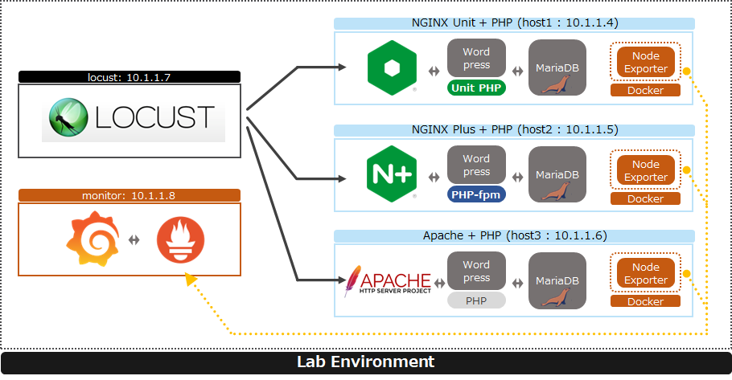
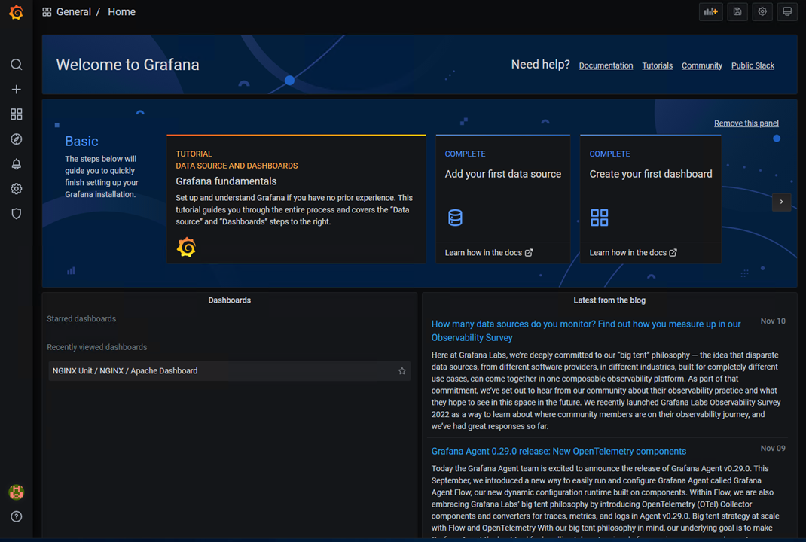
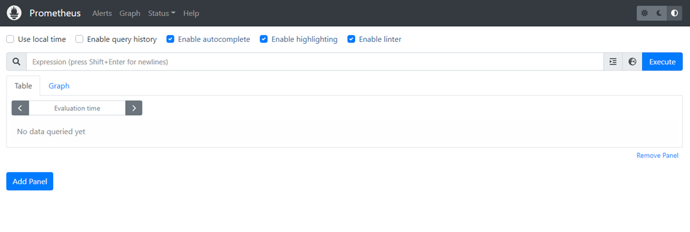
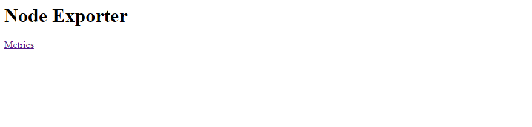
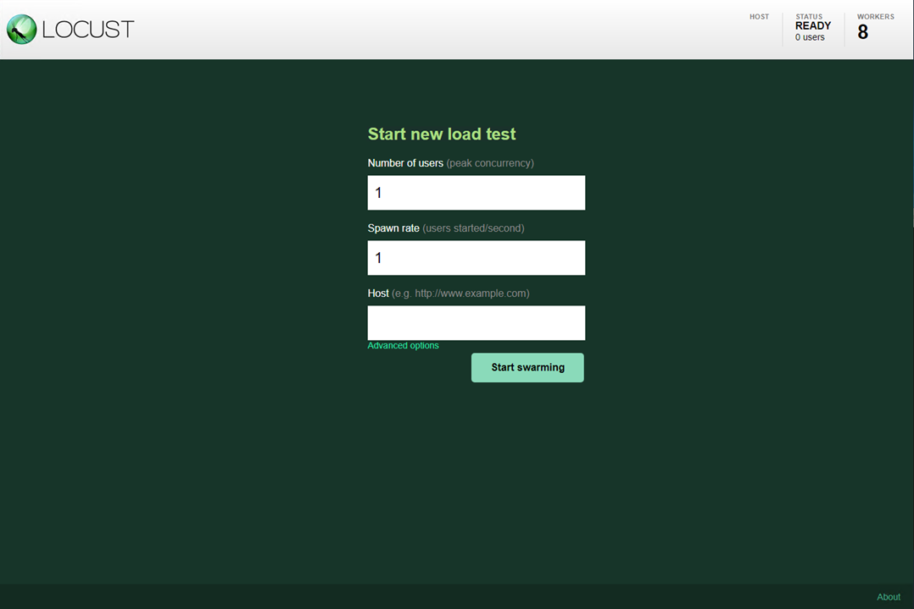
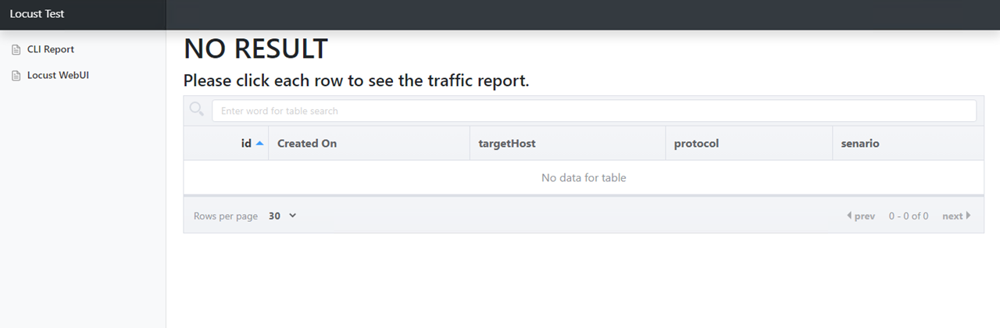

ラボ環境の確認
####

本ラボ環境は予めセットアップが完了しています。
セットアップ手順をご覧になりたい方は、 `Tips1. 各種アプリケーションのデプロイ <>`__ を参照してください

ラボ環境の各種構成について示します。動作を優先して確認されたい方はこのステップを飛ばして頂いて問題ありません。

1. ラボ環境構成
====

ラボ環境は以下のような構成となっています

- ラボ環境は以下のような構成
  - Locust: 10.1.1.7
    - パフォーマンステストツール
    - コンテナで実行する
    - CLIやWebUIを用いて操作する

  - monitor: 10.1.1.8
    - Grafana , Prometheus を監視サーバとして実行する
    - コンテナで実行する
    - 各HostにNode Exporterを実行し、そこからステータスを取得する

  - Webサーバ: 10.1.1.4, 10.1.1.5, 10.1.1.6
    - WebサーバとWordPress、MariaDBをデプロイ、コンテンツを応答する
    - Webサーバとして、10.1.1.4 が NGINX Unit、 10.1.1.5 が NGINX Plus、 10.1.1.6 が Apache を利用する

2. NGINX Unit + PHP 
====

NGINX Unit
----

NGINX Unit と Unit PHP のパッケージをインストールします。

.. code-block:: bash
  :caption: NGINX Unit をInstallする Ansible Playbook
  :linenos:
  :emphasize-lines:

  - name: Install NGINX Unit
    include_role:
      name: nginxinc.nginx_unit
    vars:
      nginx_enable: false
      nginx_unit_enable: true
      nginx_unit_modules: 
        - unit-php 

外部からのリクエストに対し、NGINX Unit が PATHに応じて、静的HTMLファイルの応答と、WordPressのPHPを実行する構成とします。

.. code-block:: bash
  :caption: NGINX Unit の設定ファイル
  :linenos:
  :emphasize-lines: 2-13, 15-48, 50-64

  {
      "listeners": {
          "*:80": {
              "pass": "routes"
          },
          "*:443": {
              "pass": "routes",
              "tls": {
                  "certificate": "bundle"
              }
          }
  
      },
  
      "routes": [
          {
              "match": {
                  "uri": [
                      "/html/*"
                  ]
              },
              "action": {
                  "share": "/var/www/$uri",
                  "index": "index.html"
              }
          },
          {
              "match": {
                  "uri": [
                      "*.php",
                      "*.php/*",
                      "/wp-admin/"
                  ]
              },
  
              "action": {
                  "pass": "applications/wordpress/direct"
              }
          },
          {
              "action": {
                  "share": "/var/www/wordpress$uri",
                  "fallback": {
                      "pass": "applications/wordpress/index"
                  }
              }
          }
      ],
  
      "applications": {
          "wordpress": {
              "type": "php",
              "targets": {
                  "direct": {
                      "root": "/var/www/wordpress/"
                  },
  
                  "index": {
                      "root": "/var/www/wordpress/",
                      "script": "index.php"
                  }
              }
          }
      }
  }

- 2行目の ``listeners`` により、通信を待ち受けるポート番号を指定します
- ``TCP/80`` と ``TCP/443`` の双方で通信を受け付けた場合には ``routes`` に従って処理するよう指定します
- ``TCP/443`` では ``HTTPS`` で通信を受け付ける想定のため、利用する 証明書・鍵のBundleを指定しています。このBundleは別途NGINX Unitに設定済みのオブジェクト名を指定します
- 15行目の ``routes`` で、通信を転送するルールを指定します。こちらで、静的HTMLファイルやどのプログラムを実行するか指定します
- ``match`` が PATH の条件を指定し、そちらに該当した場合に実行する内容を ``action`` に指定します
- ``/html/`` 宛の通信は、 ``/var/www/html/index.html`` を応答します
- ``*php`` や ``/wp-admin/`` に該当した場合には、 50行目に示した ``applications`` 配下の　``wordpress`` 、 ``targets`` が ``direct`` に従って処理します
- それ以外の内容は 41行目の内容に従って処理します

改めて通信がどの様に処理されるか以下の表にまとめます

======= ================ ========================
URL     実行される内容   参照するホスト上のパス
------- ---------------- ------------------------
/html/  静的HTMLの応答   /var/www/html/
\*php等 WordPressの応答  /var/www/wordpress/
======= ================ ========================

実際にホスト上のPATHを確認しファイルが配置されていることを確認してください

NGINX Unitは、NGINX Unitをデプロイしたホスト上のSocketに対しリクエストを実行することで設定を行います
環境のセットアップは Ansible URI module を利用します。Playbookの内容は `setup-nunit.yaml <https://github.com/BeF5/f5j-nginx-performance-lab/blob/master/ansible/web-servers/nunit/setup-nunit.yaml>`__ を参照してください

NGINX Unit に対し、HTTPSで利用する 証明書・鍵 をアップロードする参考手順を以下に示します

.. code-block:: bash
  :caption: NGINX Unit の設定ファイル
  :linenos:
  :emphasize-lines:

  # 証明書、Root証明書、秘密鍵を一つのファイルにまとめます
  cat cert.pem ca.pem key.pem > www.example.com.rsa2k.pem
  # 以下Curlコマンドで、一つにまとめたファイルを bundle という名称でNGINX Unitにストアします
  # PATH: /certificates/<NGINX Unit ストア内の証明書名>
  curl -X PUT --data-binary @www.example.com.rsa2k.pem --unix-socket /var/run/control.unit.sock http://localhost/certificates/bundle

NGINX Unit に対し、上記設定ファイル を反映する方法を示します

.. code-block:: bash
  :caption: NGINX Unit の設定ファイル
  :linenos:
  :emphasize-lines:

  curl -X PUT --data-binary @wordpress.json --unix-socket /var/run/control.unit.sock http://localhost/config/

Wordpress + MariaDB
----

MariaDB及び各種必要となるファイルは `install-mariadb.yaml <https://github.com/BeF5/f5j-nginx-performance-lab/blob/master/ansible/web-servers/common/install-mariadb.yaml>`__ に記載の通り設定します
Wordpressは `install-wordpress.yaml <https://github.com/BeF5/f5j-nginx-performance-lab/blob/master/ansible/web-servers/nunit/install-wordpress.yaml>`__ に記載の通り設定します
Wordpressを実行するユーザなど各Webサーバごとに異なりますが、基本的な設定内容は同様です。

3. NGINX Plus + PHP 
====

NGINX Plus の場合、Webサーバとして NGINX Plusが動作します。
NGINX Plus はPHPを実行できないため、PHP-fpm を動作させ、Wordpressを実行します。NGINX Plus は Wordpress宛の通信を受け取ると、PHP-fpm が待ち受けるSocketに対し通信を転送し、その後PHP-fpmからの応答を返します。

.. code-block:: bash
  :caption: NGINX Unit の設定ファイル
  :linenos:
  :emphasize-lines: 1-3, 7-11, 31-36, 43-46

  upstream php {
      server unix:/run/php/php7.4-fpm.sock;
  }
  
  server {
  
      listen 80;
      listen 443 ssl;
  
      ssl_certificate     /var/www/ssl/www.example.com.pem ;
      ssl_certificate_key /var/www/ssl/www.example.com.key ; 
  
      root /var/www/wordpress; 
      index index.php;
  
      location = /favicon.ico {
          log_not_found off;
          access_log off;
      }
  
      location = /robots.txt {
          allow all;
          log_not_found off;
          access_log off;
      }
  
      location / {
          try_files $uri $uri/ /index.php?$args;
      }
  
      location ~ \.php$ {
          include fastcgi_params; 
          fastcgi_intercept_errors on;
          fastcgi_pass php;
          fastcgi_param  SCRIPT_FILENAME ${document_root}$fastcgi_script_name;
      }
  
      location ~* \.(js|css|png|jpg|jpeg|gif|ico)$ {
          expires max;
          log_not_found off;
      }
  
      location /html {
          root   /var/www/;
          index  index.html index.htm;
      }
  
  }

- 1行目に ``upstream`` を指定し、 PHPの転送先となる PHP-fpm が待ち受ける Socket を転送先として指定しています
- 7-8行目で ``TCP/80`` 、 ``TCP/443`` で通信を待ち受ける設定をし、 SSLに用いる証明書ファイルを指定します
- 31行目に示す location で、 ``.php`` 宛の通信を PHP-fpm に転送するよう ``fastcgi_pass`` で ``php(upstream)`` を指定しています。その他必要な設定、パラメータを指定します
- 43行目で、静的HTMLファイルを対象とした通信を受け付け、応答を返します

Wordpress + MariaDB の基本的な構成は `NGINX Unitで記載した内容(Wordpress + MariaDB) <>`__ と同様です

4. Apache + PHP 
====

Apacheでは必要となるパッケージをインストールし、指定のフォルダにWordpress、静的HTMLファイルを配置しています。
Wordpress + MariaDB の基本的な構成は `NGINX Unitで記載した内容(Wordpress + MariaDB) <>`__ と同様です

5. Locust / Grafana + Prometheus / node-exporter
====

- Locust / Grafana + Prometheus / node-exporter はそれぞれ個別にインストールする方法もありますが、今回のラボではDocker Imageを実行しアプリケーションを利用しています
- Locust は WebUI や、予め設定したシナリオをCLI(厳密にはDocker RUNで対象シナリオのファイルを指定)を用いて通信を実行します
- それらの結果を、node-exporter で取得し、Prometheus にてメトリクスを取りまとめ、Grafana のダッシュボードで確認します

6. 踏み台ホストから各種コンテンツへのアクセス
====

上記で示した手順によりデプロイしたコンポーネントに以下URLよりアクセスいただけます

- Grafana
  - `http://10.1.1.8:3000/ <http://10.1.1.8:3000/>`__
  - ログインが求められる場合には、 user:admin , password:admin でログインしてください

- Prometheus
  - `http://10.1.1.8:9090/ <http://10.1.1.8:9090/>`__

- node-exporter
  - 各ホストで実行しています。対象となるホストのIPアドレスを指定してください
  - `http://10.1.1.4:9100/ <http://10.1.1.4:9100/>`__

- 各WebServer
  - 各WebサーバでWordpress(PHP)、静的HTMLを応答する構成となります。対象となるホストのIPアドレスを指定してください
  - Wordpress: `http://10.1.1.4/ <http://10.1.1.4/>`__ (対象ホスト 10.1.1.4 の例)

  - 静的HTML: `http://10.1.1.4/html/ <http://10.1.1.4/html/>`__ (対象ホスト 10.1.1.4 の例)

.. image:: ./media/web-html-top.png
   :width: 500

- Locustサーバ Webページ 
  - このラボでは、LocustのWebUI、CLI双方でコマンドを実行します。テスト内容に応じて以下の内適切な内容を閲覧ください
  - Locust WebUI: `http://10.1.1.7:8089/ <http://10.1.1.7:8089/>`__

  - CLIで実行したレポートを確認するWebページ: `http://10.1.1.7/ <http://10.1.1.7/>`__

